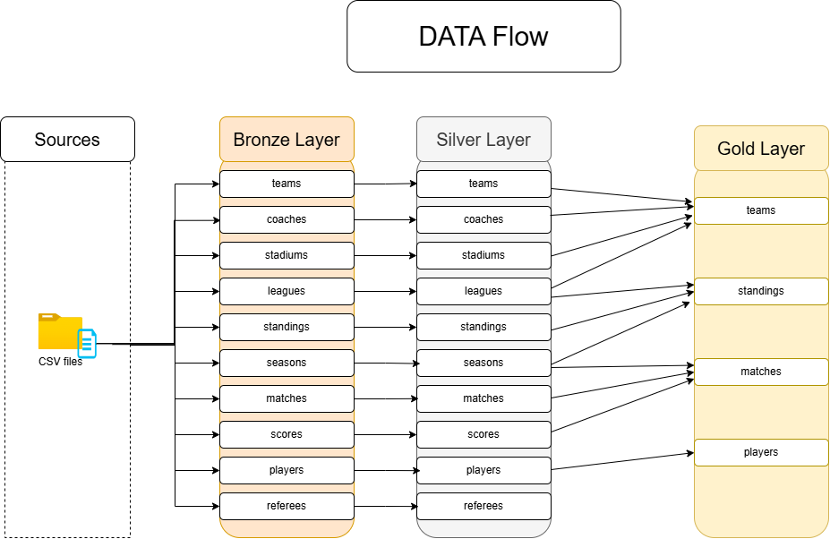

# 🏗️ Data Warehouse Layer

## Overview

This folder contains the SQL Server data warehouse implementation built using a Medallion Architecture (Bronze → Silver → Gold).

The warehouse transforms raw CSV soccer data into clean, structured, and analytics-ready datasets that serve as the foundation for analytics and Power BI reporting.

---

## Architecture

The warehouse is organized into three layers:

### 🥉 Bronze Layer — Raw Data
- Stores data as received from source files
- Tables mirror the original CSV structure
- No transformations applied

### 🥈 Silver Layer — Cleaned Data
- Data cleansing and standardization
- Handling missing and inconsistent values
- Applying business rules and transformations

### 🥇 Gold Layer — Analytical Model
- Integrated and business-ready datasets
- Analytical views optimized for reporting
- Source for analytics and BI dashboards
- 

---

## Folder Structure
data-warehouse/
│
├── scripts/
│ ├── bronze/
│ ├── silver/
│ ├── gold/
│
│── docs/
└── README.md

---

## Technologies

- Microsoft SQL Server
- T-SQL
- ETL Processes
- Data Warehousing Concepts

---

## Role in the Project

This layer provides the foundation for:

- Analytical SQL queries (analytics folder)
- Power BI dashboards (powerbi folder)

It represents the data engineering component of the end-to-end pipeline.

